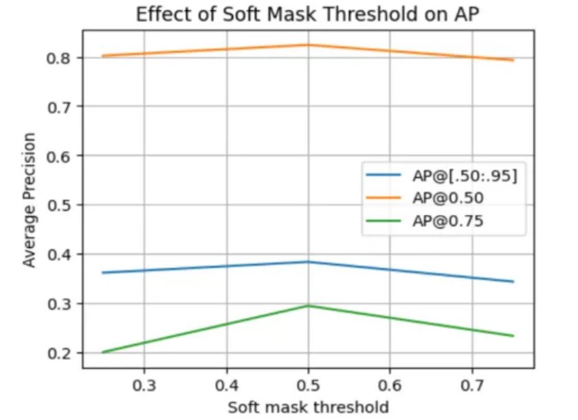

#  Instance Segmentation of Tiny Traffic Lights Using Mask R-CNN (Bosch)

This project is a direct extension of my earlier work:
> [Hybrid-Detection-and-Segmentation-of-Tiny-Traffic-Lights-with-YOLOv8-and-SAM ](https://github.com/Monisha-RK10/Hybrid-Detection-and-Segmentation-of-Small-Traffic-Lights-using-YOLOv8-and-SAM)

- The project tackles the challenging task of **instance segmentation** of **small-scale traffic lights** using the Bosch Small Traffic Lights dataset.
- A custom Mask R-CNN pipeline is implemented to detect and segment red and green traffic lights with pixel-level precision.
- Evaluates the effect of different soft mask thresholds (0.25, 0.5, 0.75) on AP (Average Precision).

> **Read the full write-up on Medium**:  
> [Instance Segmentation of Tiny Traffic Lights Using Mask R-CNN (Bosch)](https://medium.com/@monishatemp20/instance-segmentation-of-tiny-traffic-lights-using-mask-r-cnn-bosch-dataset-f88a8d33e1e3)

## Project Overview

- **Format**: COCO-style annotations (converted via Makesense.ai).
- **Model**: Torchvision's pretrained Mask R-CNN with custom heads.
- **Classes**:  
  `1 → Red Traffic Light`,  
  `2 → Green Traffic Light`
- **Dataset Size**: ~100 manually curated Bosch images.
- **Output**: Segmentation masks for each instance of traffic lights.

## Effect of Soft Mask Threshold on Average Precision

From above plot, the best performance is at threshold = 0.5 overall.

- AP@0.75 improves significantly from 0.25.
- AP@0.50 remains strong across thresholds.
- AP drops at 0.75 threshold because the masks become too tight, missing part of the object.

## Evaluation: COCO Metrics (Mask R-CNN)

|  AP@0.50:0.95 (All)| AP@0.50  | AP@0.75| AP (Small Objects)  | AP (Medium Objects) | AP (Large Objects) | AR@0.50:0.9] (All, 100 dets) |  AR (Small)|
|--------------------|----------|--------|---------------------|---------------------|--------------------|------------------------------|------------|
|  **0.39**          |**0.82**  | 0.30   |  **0.4**            |  0.08               | -1.00              |  0.48                        |0.5         |

> The model performs strongly on **small object segmentation**, which is critical for traffic light scenarios.

## Comparison with YOLOv8 & SAM

| Model           | GT Objects | Matched (IoU>0.5) | Mean IoU (SAM) | Mask AP@50 | Mask AP@50-95 |
|---------------- |------------|-------------------|----------------|------------|---------------|
| **YOLOv8 + SAM**| 1186       | 275               | 0.0757         | -          |-              |
| **YOLOv8n-seg** | -          | -                 | -              |0.02        |0.0075         |
| **YOLOv8s-seg** | -          | -                 | -              |0.07        |0.203          |
| **Mask R-CNN**  | -          | -                 | -              |**0.82**    | **0.4**       |

> **Mask R-CNN outperforms both YOLOv8 and SAM pipelines** for instance segmentation of tiny traffic lights.

## Sample Output Visualizations

## Author

**Monisha**  
Connect via [Medium](https://medium.com/@monishatemp20)  

---

